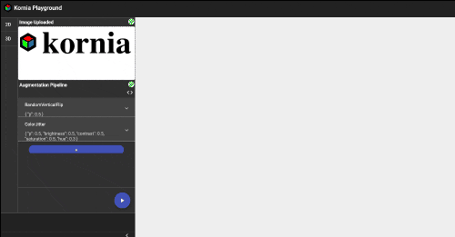

# Kornia Augmentation Playground

Demo app for experimenting data augmentations. For each setting, it would generate 8 outputs.



## Frontend Running
```bash
$ npm install
$ ng serve
```

## Backend Running
In another terminal:
```bash
$ cd simple_backend
$ pip install -r requirements.txt
$ python index.py
```

## Note

Currently, only ```RandomHorizontalFlip```, ```RandomVerticalFlip``` and ```ColorJitter``` are fully supported.

The future direction shall be:
1.  supporting all 2D augmentations
2.  supporting all 3D augmentations / visualizations
3.  supporting in-browser computation by generating ONNX model
4.  code auto-generation